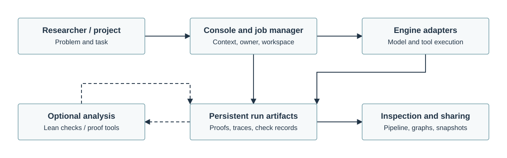

# Math Framework LLM Assistant For Research

**Repository technical report · Richard C, Eric J · revised 20 September 2026**

## Abstract

Mathematical research with AI agents produces more than a final answer: candidate arguments, failed approaches, computational checks, formal declarations, references, and execution traces. These artifacts often remain fragmented across tools, making it difficult to determine what was attempted and what the evidence establishes. We describe Ansatz, the research workspace implemented by the Agent Monitor repository. The system connects multiple proving harnesses to a common run representation, preserves artifacts and continuation context, supports collaborative problem editing, and presents informal arguments alongside Lean verification results. Its central design principle is to keep the mathematical claim, the process that produced an artifact, and the strength of its evidence inspectable together. The working tree registers twelve engine configurations and includes source-attributed mathematical catalogues. Two examples distinguish partial progress from a completed target: a curated Erdős–Straus case supplies 499 exact finite witnesses and six Lean theorems, while a saved Kimi run proves that $\sqrt{8}$ is irrational and its formal source passes an independent Lean recheck. Twenty recorded collaboration trials at eight and sixteen clients report no lost or duplicated characters; six application tests check editing, access, and sharing behavior. These results establish specific artifact and collaboration properties. They do not measure mathematical discovery rates or comparative proving performance. We detail the remaining gaps in graph semantics, formalization fidelity, engine integration, and reproducible deployment.

## 1. Introduction

A research session rarely proceeds directly from a problem statement to a complete proof. Researchers explore special cases, search for lemmas, test possible counterexamples, revise definitions, and discover missing hypotheses. AI agents can contribute to these activities, but their outputs introduce a coordination problem: an argument can look complete while its crucial step remains unsupported, and a successful formal check can concern a statement different from the intended problem.

Ansatz treats the run as the basic unit of research evidence. A run retains its problem, engine configuration, outputs, intermediate activity, and verification artifacts. Researchers can inspect this material, continue an attempt with feedback, or associate several attempts with a shared project. The public interface in the inspected snapshot uses the name **Ansatz**; the repository and Python implementation retain **Agent Monitor**. The system description and initial artifact checks refer to the 15 September snapshot. This 20 September revision incorporates the separately recorded 16 September collaboration batch and an independently rechecked solved example.

The organizational example for this report is Chen et al.'s *Prove2Me*, which describes an agent-facing formalization platform through its basic design, collaboration mechanisms, case studies, and usage [R1]. We use that progression to explain this repository. The text, implementation analysis, and measurements here concern Ansatz.

This report makes four contributions:

1. A source-grounded account of how heterogeneous proving engines produce a common, inspectable run record.
2. An explanation of the boundaries between informal proof analysis, computational evidence, Lean checking, and statement-fidelity review.
3. A description of project editing, account-owned runs, reusable research context, and explicit sharing.
4. A reproducible evidence package that separates fresh checks, historical measurements, corpus inventories, and untested capabilities.

The contribution is an integration architecture and its evidence model. Establishing that this architecture improves mathematical success requires the controlled evaluation proposed in Section 7.

## 2. Context and design position

### 2.1. Collaborative formalization

Prove2Me separates immutable theorem statements from submitted proofs, organizes work into audited missions, and uses proof-sketches to express dependence on independently solvable statements. Accepted formal dependencies support composition as their obligations close [R1]. Ansatz instead organizes its main interface around mutable research workspaces and engine runs. Its projects preserve a shared question and related attempts; they are not an implementation of Prove2Me's theorem registry.

Both designs make intermediate work visible. Their correctness boundaries differ: a run graph in this repository can describe an agent's reasoning without constituting a formally checked proof decomposition. The comparison motivates explicit artifact semantics rather than a performance ranking.

### 2.2. Proving engines and formal tools

The repository integrates existing harnesses rather than introducing a new foundation model or training method. Its registry includes the vendored Hermes core, IMProof/ProofStack author–critic workflows, and the UCLA harness, alongside console-owned runners and wrappers around external agent CLIs. Upstream attribution is retained in `ATTRIBUTION.md`; engine labels describe adapters, not independently evaluated mathematical capabilities.

Lean supplies a different kind of evidence. In Lean, a theorem's statement is a type and its proof is a term checked against that type [R2]. The application orchestrates source generation, compilation, revision, and reporting around this checker. The semantic correspondence between that formal type and a researcher's natural-language question still requires examination.

## 3. Basic design of Ansatz

### 3.1. The run as an evidence container

Conceptually, write a run as

$$
R=(q,e,c,A,T,V),
$$

where $q$ is the problem snapshot, $e$ the engine, $c$ the launch context, $A$ the artifacts, $T$ the execution trace, and $V$ the verification records. This notation summarizes the implementation; it is not a serialized schema. The run's owner and, where applicable, project membership control access to its material.

`jobs.py` creates the workspace, prepares library context and attachments, selects the runner, records progress, and preserves outputs. Adapters write or expose proof documents and emit activity from which the monitor builds a common view. Continuations can reuse the workspace and incorporate feedback; this is application-level continuation and does not establish deterministic replay of an external model session.



The main console uses Python HTTP handlers. Run execution uses daemon threads and local subprocesses, with JSON run records and caches written through temporary files and replacement. Project, sharing, and research-community state use SQLite. There is no durable distributed job queue in the inspected implementation. A process restart therefore does not imply transparent resumption of every in-flight engine.

### 3.2. Engine adapters

The source registry contains three built-in entries and nine entries in its CLI registry. The latter category includes console-owned Python runners as well as external executable integrations.

| Registry group | Entries | Role represented in source |
| --- | --- | --- |
| Built-in | Hermes; IMProof; UCLA | Tool-using agents and specialized proving workflows |
| Console-owned or adapted runners | Kimi; Plain; DeepAgents; Meta-Harness | Draft–critique–refine, baseline inference, agent execution, or harness adaptation |
| External CLI integrations | Claude Code; Codex; OpenClaude; OpenHands; OpenClaw | Account- or provider-configured agent processes |

The **twelve** entries are an integration inventory. Availability depends on executables, dependencies, credentials, and compatible adapter contracts. Section 8 identifies integration gaps in this working tree; registration does not imply successful execution of every route.

For CLI-style engines, `CLIEventParser` consumes structured output where supported and otherwise retains readable lines. It records messages, reasoning events, tool activity, model metadata, and usage when available. The common interface allows a researcher to inspect different workflows without requiring their native logs to have identical formats.

### 3.3. Normalized traces and accounting

`schema.normalize_run` fills fields such as `pipeline`, `agents`, `edges`, and `totals`, and derives missing aggregates. It is permissive dictionary normalization, not a complete validator. The module's narrow static engine type also predates the expanded runtime registry.

For an agent record lacking an aggregate input count, the current implementation computes

$$
I_a=I_a^{\mathrm{reported}}+I_a^{\mathrm{cache\ read}}+I_a^{\mathrm{cache\ write}}.
$$

This is an implementation convention. Providers may report cache tokens as a subset of another field, so adapter-specific accounting must be reconciled before comparing totals. Missing cost data likewise cannot be interpreted as free inference. Run-level costs are useful observations only with the billing basis and source of the telemetry attached.

The pipeline and map views visualize execution activity. An execution edge can mean that one agent stage follows another. It should not be read as a mathematical entailment. Moreover, an `agents` array item can represent a message or tool event; its length is not necessarily the number of autonomous agents or model calls. Proof-structure graphs, described next, are separate artifacts with different meanings.

### 3.4. Evidence levels and verification

Ansatz preserves several evidence types. Their distinction is essential to interpreting a result.

| Evidence | What it supports | Remaining obligation |
| --- | --- | --- |
| Agent-produced argument or critique | A proposed derivation and its review history | Mathematical correctness requires review |
| Finite computation | The checked cases under the stated arithmetic and search bounds | Generalization beyond those cases |
| Lean compilation | Acceptance of the supplied file by the configured toolchain | Admissions, assumptions, and target fidelity |
| Admission-aware Lean check | Successful check plus application checks for explicit gaps | Imported trust and faithful formalization |
| Statement-fidelity audit | Mechanical flags and an agent's assessment of correspondence | Independent semantic judgment |

The base status mapping in `lean_verify._status_from_check` is explicit. Missing tooling yields `toolchain_missing`; a failed check yields `failed`; compilation mode can yield `compiled` even with admissions. In checking mode, a successful file with detected `sorry` or `admit` becomes `incomplete`, and a successful file without them becomes `verified`. A subsequent major fidelity finding can downgrade the latter to `unfaithful`.

These names are application statuses, not a general soundness theorem for all accepted inputs. Admission detection and several fidelity flags use regular expressions. The code flags constructs such as introduced axioms, disabled kernel checks, or vacuous conclusions, and can request an LLM assessment of whether the formal statement matches the problem. It does not implement Prove2Me's immutable-target contract or a complete elaborator-derived audit of every imported assumption. An affirmative model audit remains fallible.

The deterministic proof tools provide bounded expression evaluation, counterexample search, statement-anchor comparison, and audit-output validation. They use an allowlisted Python abstract-syntax-tree evaluator with expression and integer-size bounds; counterexample search also caps cases and checks elapsed time between cases. Exhausting a finite counterexample search establishes only that no counterexample was found in that domain. The current evaluator also has arithmetic edge cases: a negative integer exponent can produce a floating-point value. Claims of exactness must therefore refer to the specific checked operation; the worked example in Section 6 uses Python `Fraction` directly.

### 3.5. Proof graphs and cross-layer links

`proof_graph.py` can ask a model to extract an informal proof graph. Its sanitizer normalizes node kinds, removes duplicate identifiers and edges, and drops self-links and edges with missing endpoints. Although the generation prompt requests a directed acyclic graph, the sanitizer does not check acyclicity, reachability, or logical sufficiency. A rendered graph is an aid to inspection.

The local Lean graph parser identifies declarations from source text and looks for references to earlier declaration names. These are textual dependencies, not dependencies extracted from elaborated proof terms. It can miss aliases, implicit arguments, namespace resolution, and dependencies introduced by automation.

`proof_bridge.py` associates informal nodes with formal declarations using token overlap, label similarity, and a specialized numeric-pattern match. A run-level gate checks the recorded Lean status, admission count, and fidelity audit before assigning stronger badges. Partial-result handling attempts to exclude admission-dependent declarations through textual analysis. These associations are useful navigation hints; neither their scores nor their badges establish semantic equivalence between an informal node and a Lean theorem. The report treats formal artifacts and actual checker output as the primary evidence.

## 4. Collaboration and reusable research context

### 4.1. Shared problem editing

A project stores a shared problem document, membership, invitations, and links to member-owned runs. The editor sends character operations instead of whole-document replacements. Each inserted character has a stable identifier, an anchor identifying the preceding character, its value, and a server-assigned order. Deletion retains a tombstone so that stale clients can still address the old anchor.

Suppose two researchers both see `ab` and independently insert `X` and `Y` after `a`. When the first insertion commits before the second, the present ordering renders `aYXb`. Both edits survive. Deleting the original `a` leaves `YXb`, while the deleted identifier remains available as an anchor.

An edit batch follows this transaction:

1. Acquire SQLite's write reservation with `BEGIN IMMEDIATE`.
2. Check membership and load the current character state.
3. Validate and apply operations, retaining deleted anchors.
4. Render the visible document and check capacity bounds.
5. Store the state, increment the revision, and commit before acknowledging success.

Replaying an insertion with the same identifier, value, and anchor does not duplicate text. Reusing an identifier with conflicting content fails. An invalid operation rolls back the batch. Replays still increment the revision, so the idempotence property concerns document content rather than all response metadata.

This is a server-ordered sequence with RGA-like anchors. It is not an implementation of arbitrary offline or multi-server convergence. The current document limits are 20,000 visible characters and 100,000 stored nodes. Browser batches contain up to 2,000 operations, and polling occurs every 1.5 seconds. Rendering sorts siblings and traverses stored nodes; writes load and serialize the complete document state. SQLite serializes writers, making sustained contention and tombstone growth relevant scaling concerns.

### 4.2. Projects, runs, and access

Launching a project run copies the shared statement and appends the member's assigned task. The run uses the initiating account's configuration. Later project edits do not silently replace that launch snapshot. Members can inspect project results and continue work under the application's access checks.

Invitations and public result links serve different purposes. A project invitation grants membership. A result link exposes an explicit, read-only snapshot selected by its owner. The snapshot allowlists the problem, proof, agent summaries, graph data, and available Lean source; it does not publish the workspace directory. Revoking a link or deleting its source run disables future access through that link. The mechanism cannot recall copies already downloaded.

The six current collaboration tests include membership revocation, insertion retries, invalid-batch rollback, snapshot filtering and symlink handling, project launch context, and the public worked-example route. Their runner is stubbed where an actual agent would start; these tests exercise application behavior without model inference.

### 4.3. Libraries and published memory

The shared local library stores memory, skills, and tools that can be materialized under `_library/` and included in a run's prompt. Its current storage and API are global to the installation, without account ownership parameters; it should not be interpreted as an account-isolated personal library. Executable tools are part of the local engine's trust boundary. Their presence in a reusable library does not certify their outputs.

Research-community memory has a separate publication path. `research.publish_memory` checks provenance and eligibility before recording a result. Formal publication additionally examines the current Lean source, admission count, successful checker result, fidelity audit, and source hashes; receipt verification depends on the checker facilities present. These are application checks around stored evidence.

Retrieval in `research.compose_context` is lexical. It extracts alphabetic query words of at least four characters, requires at least two shared terms, ranks eligible memories by overlap and recency, and selects up to four excerpts of at most 2,800 characters within a 12,000-character context budget. Forum posts are outside this retrieval query. The injected block explicitly treats retrieved material as reference content whose claims and applicability need checking. This mechanism reuses context; it does not update model weights or demonstrate learned mathematical ability.

## 5. Source-attributed mathematical catalogues

The research atlas provides two complementary data views. Neither is a count of results proved by Ansatz.

The Stacks-derived view indexes **14,754** source-tagged statements across **109** chapters and **24** fields. Its **37,440** retained edges form a source-ordered reference DAG. Edges describe references selected by the importer and do not establish necessary proof premises. The importer omits 75 forward references to maintain this ordering. There are **14,627 distinct statement bodies** across the 14,754 nodes; every node's statement hash was rechecked during report preparation. Attribution and the GNU Free Documentation License notice remain with the dataset's accompanying source materials.

The informal–formal bridge imports a supplied graph and matching archives for **60** curated projects. It contains **24,950** informal entries, **16,682** actual formal declarations, and **3,892** placeholder nodes for unresolved or ambiguous references. Its **20,656** correspondence edges divide as follows:

| Resolution in the supplied export | Correspondences |
| --- | ---: |
| Resolved to a project declaration | 16,374 |
| Resolved to a Mathlib declaration | 387 |
| Unresolved reference | 2,492 |
| Ambiguous reference | 1,403 |

The bridge also preserves **54,128** informal `USES` records and **72** `PROVES` records. Their direction and meaning come from the supplied blueprints. The source contains no formal-to-formal declaration dependencies. Importing these records does not compile the projects or verify statement equivalence.

This imported bridge is distinct from the per-run heuristic bridge in Section 3.5. The former preserves externally supplied correspondences; the latter proposes associations between a run's artifacts. The data inventory in `evidence.json` records the counts and source digests used here. `docs/dag-sources.md` describes selection, unresolved references, incomplete signatures, and licensing in detail.

## 6. Worked examples: partial progress and a solved problem

### 6.1. The target and a partial family

The bundled example asks whether every integer $n\geq 2$ admits positive integers $x,y,z$ satisfying

$$
\frac{4}{n}=\frac{1}{x}+\frac{1}{y}+\frac{1}{z}.
$$

It points to Erdős Problem 242 as its mathematical source. The example makes no claim to resolve the universal problem. For $n=2m$ with $m\geq 1$, the choice $(x,y,z)=(m,2m,2m)$ gives

$$
\frac{1}{m}+\frac{1}{2m}+\frac{1}{2m}=\frac{2}{m}=\frac{4}{2m}.
$$

This elementary family explains the even case. Its general identity is prose mathematics in this example, not a theorem supplied by the accompanying Lean file.

### 6.2. Exact finite evidence

The generator searches for witnesses for each $n$ from 2 through 500. With $a=4x-n$ and $b=nx$, subtracting $1/x$ reduces the remaining equation to $1/y+1/z=a/b$, so

$$
z=\frac{by}{ay-b}.
$$

The search accepts a candidate only when the denominator is positive and divides the numerator. It then verifies the original equation using exact rational arithmetic. The report preparation independently rechecked all **499** stored witness records, confirmed positivity, and confirmed that their indices are exactly the integers 2 through 500. This fresh check validates the saved results; it is distinct from rerunning the generator's entire search.

### 6.3. Lean artifact and open obligation

The formal predicate uses the cross-multiplied identity

$$
4xyz=n(yz+xz+xy),\qquad x>0,\ y>0,\ z>0.
$$

The source supplies five concrete witness theorems and a sixth theorem, `checked_cases`, that combines them.

| Theorem | n | x | y | z |
| --- | ---: | ---: | ---: | ---: |
| `witness_two` | 2 | 1 | 2 | 2 |
| `witness_three` | 3 | 1 | 4 | 12 |
| `witness_five` | 5 | 2 | 4 | 20 |
| `witness_seven` | 7 | 2 | 28 | 28 |
| `witness_thirteen` | 13 | 4 | 26 | 52 |

During the original preparation on 15 September, the command below succeeded with Lean **4.14.0**, commit prefix `410fab728470`:

```sh
lean agent_monitor/examples/ErdosStraus.lean
```

Its final axiom report states that `checked_cases` depends on no axioms. The file defines `ErdosStraus` as a proposition but supplies no proof of it. Accordingly, the curated graph leaves the general target disconnected from the finite-case conclusion. There is no formal edge that turns five witnesses, or 499 computational checks, into a universal theorem.

The planner, explorer, and reviewer nodes are illustrative roles in a curated demonstration. They are not a captured multi-agent experiment. No token usage, cost, model success rate, or autonomous discovery claim is inferred from this example.

### 6.4. A solved problem: irrationality of the square root of eight

To complement the finite progress above, an actual saved run asks for a complete
proof that $\sqrt{8}$ is irrational. Run
`kimi_adhoc_026cb7ed_a1118f831d`, registered under Kimi, was created on 15 September
2026. Its saved artifacts include an informal parity argument and a Lean proof of
the exact standard statement `Irrational (Real.sqrt 8)`. The proof below is a concise editorial restatement of that saved argument.

**Theorem.** The real number $\sqrt{8}$ is irrational.

**Proof.** If an integer is odd, its square has the form
$(2k+1)^2=2(2k^2+2k)+1$ and is odd. Thus an integer with an even square is even.
Suppose $\sqrt{8}=p/q$ for positive coprime integers $p,q$. Then $p^2=8q^2$, so
$p=2a$ for an integer $a$. It follows that $a^2=2q^2$, so $a=2b$ for an integer
$b$. Substitution gives $q^2=2b^2$, so $q$ is even. Both $p$ and $q$ are therefore
divisible by $2$, contradicting coprimality. $\square$

The formal proof uses a different decomposition: it establishes
$\sqrt{8}=2\sqrt{2}$ and invokes Mathlib's `irrational_sqrt_two`. The saved
verification record from 15 September reports success with no detected admissions
and an affirmative fidelity audit. An independent check on **20 September 2026**
compiled the identical source with **Lean 4.14.0**. The recorded source hash
matches the copied file, and `#print axioms main` reports
`[propext, Classical.choice, Quot.sound]`, with no `sorryAx`. These are the
reported logical dependencies; the result is not axiom-free. The reproduction
uses the installed Mathlib libraries and does not independently rebuild them.

The saved informal output ends with a “Partial Progress” label, whereas its
argument and the checked formal theorem establish this target completely. The
example therefore also illustrates why outcome labels should be read alongside
the exact claim and checker output. It demonstrates a solved elementary task and
the reuse of a known theorem, without implying new discovery or a measured
success rate. The selected provenance, unchanged Lean source, and check output are retained in `reports/ansatz-technical-report/examples/sqrt-eight/`.

### 6.5. What the two examples establish

| Case | Established result | Relation to the target |
| --- | --- | --- |
| Erdős–Straus, saved computation | Positive integer witnesses for every integer from 2 through 500 | Finite progress toward a universal conjecture |
| Erdős–Straus, Lean source | Five witness theorems and their conjunction | The universal proposition remains unproved |
| Irrationality of $\sqrt{8}$, saved run | Complete informal proof and a checked theorem `Irrational (Real.sqrt 8)` | The stated elementary target is fully established |

The distinction is determined by the quantified statement and its proof. A successful finite computation, a complete theorem, an execution trace, and an informal status label each convey different information. Keeping them together allows a researcher to assess precisely how far an attempt has progressed.

## 7. Evaluation and reproducibility

### 7.1. Evidence categories

The report distinguishes dated artifact checks, recorded measurements, inventories, and source inspection. This revision does not relabel earlier executions as new measurements.

| Category | Evidence used here | Scope |
| --- | --- | --- |
| Artifact check, 15 September | Lean compile and axiom output; 499 witness validations; six collaboration tests | Specific supplied artifacts and isolated application behavior |
| Artifact recheck, 20 September | Exact saved square-root proof, successful Lean compilation, and axiom report | One complete elementary target, using installed Mathlib |
| Repeated measurement, 16 September | Ten sequential repetitions at eight and sixteen clients | Twenty isolated synthetic editing trials on one host |
| Inventory, 15 September | Registry entries, atlas arrays, statement hashes | Size and consistency of the inspected snapshot |
| Source inspection, 15 September | Runner orchestration, graph extraction, fidelity gates, memory retrieval | Implemented mechanisms and visible gaps in that snapshot |

The six collaboration tests passed with a pytest-reported duration of **1.62 seconds** on 15 September. The tests use temporary storage and synthetic identities, and stub actual run execution. The exact command and JUnit output are retained in the evidence package. No production requests or model calls were made for these checks.

### 7.2. Recorded collaboration measurements

On 16 September 2026, we repeated the isolated collaboration workload ten times sequentially. Each fresh process ran eight clients followed by sixteen clients, with separate temporary SQLite databases and 40 synchronized rounds per client count. The workload drives the actual project routes through a temporary loopback HTTP server with synthetic identities. All ten repetitions are included; no warmup run was discarded. Each client inserted three Unicode characters per round, read the shared state, and replayed every third insertion batch. The workload also exercised insertions anchored to a deleted character.

| Clients | Requests per trial | Inserted characters per trial | Replayed batches per trial |
| ---: | ---: | ---: | ---: |
| 8 | 760 | 960 | 112 |
| 16 | 1,520 | 1,920 | 224 |

| Clients | Edit p95 (ms) | Read p95 (ms) | Duration (s) |
| ---: | ---: | ---: | ---: |
| 8 | 136.955 [114.75, 138.56] | 19.27 [11.57, 23.84] | 5.1065 [4.794, 5.302] |
| 16 | 548.255 [546.02, 643.26] | 47.01 [37.84, 74.91] | 20.9455 [20.427, 22.715] |

Timings are **median [minimum, maximum] across ten repetitions per client count**. Latency columns summarize the ten per-run p95 values; they are not pooled request percentiles. Duration covers each trial's concurrent edit/read phase.

All **20 trials** passed their recorded correctness checks. Across **22,800** measured requests, the experiment inserted **28,800** characters and replayed **3,360** batches, with zero unexpected errors, lost characters, or duplicated characters. Checks cover document agreement, retries, invalid-batch rollback, identifier collisions, access revocation, restart persistence, and SQLite integrity. The recorded environment was Linux x86-64, eight logical CPUs, Python 3.13.15, and SQLite 3.53.1.

The ten raw reports, experiment manifest, and summary are retained under `reports/ansatz-technical-report/experiments/2026-09-16-ten-runs/`. Their recorded hashes match the preserved and inspected copies of `projects.py` and the reliability script. Matching those two files does not establish that every dependency or runtime condition is unchanged. The separate 9 September archive is excluded from these aggregates; its recorded host had two logical CPUs. This revision rechecked the saved aggregates without executing a new performance batch.

### 7.3. Limits of the measurements

Each concurrency level was measured ten times on one host in a single session. The fixed eight-then-sixteen order can introduce order effects, and fresh databases do not remove host-load or cache effects. The loopback server uses synthetic authentication and an enlarged connection backlog. Timings cover concurrent edit/read rounds and exclude setup, rejection checks, restart checks, production authentication, TLS, browser interaction, internet latency, and model execution. The reports do not retain individual request timings, so the table summarizes per-run p95 values without pooling requests. The observed ranges are descriptive, not confidence intervals. Small documents over 40 rounds do not establish behavior near document limits or under sustained contention.

The restart check kills the isolated process after acknowledged commits and then verifies persisted state. It does not simulate a power failure, disk loss, or termination during a commit. Explicitly replaying a request tests retry behavior, but is not a complete simulation of a disconnected browser with an unsent local queue. These are engineering observations for a bounded workload, not production capacity guarantees.

The atlas counts and individual mathematical examples measure neither theorem-proving accuracy nor cross-engine quality. The repository contains no controlled experiment established by this report that would justify a claim that one harness is more accurate, cheaper, or faster at research mathematics.

### 7.4. Proposed proving evaluation

A next evaluation should freeze a problem set, source statements, toolchain revisions, model routes, budgets, and acceptance rules before collecting results. Problems should be stratified into known proof tasks, false statements with checkable counterexamples, and research questions for which partial progress is the appropriate outcome. Public solutions and retrieved sources should be recorded to make possible contamination visible.

Hold the model and budget fixed when comparing the plain runner with structured harnesses. Separate experiments can vary reusable memory, reviewer stages, or formalization support. Repeat trials rather than relying on a single favorable attempt. Report at least:

1. **Faithful verified completion:** the fraction meeting a predeclared target and formal acceptance policy, with independent statement review.
2. **Valid partial progress:** reviewed intermediate results, explicit residual obligations, and their relation to the original target.
3. **Failure detection:** false-statement detection, failed proof rejection, and cases where an incorrect result receives a positive label.
4. **Resource use:** wall time, tool calls, model-reported tokens, and costs with a consistent billing basis and explicit missing values.
5. **Collaboration overhead:** conflicting work, repeated derivations, context exchanged, and time to incorporate another attempt's result.

This is a proposed protocol, not an experiment performed for this report.

## 8. Limitations and engineering priorities

**Formalization fidelity.** Compilation establishes a property of the submitted formal source. Regex checks and LLM read-back do not replace independent examination of the target and definitions. A stronger acceptance path would bind results to an audited target, record the exact source and environment, inspect actual axiom dependencies, and preserve a trustworthy checker receipt.

**Graph semantics.** Informal graphs can retain cycles, Lean dependencies are text-derived, and cross-layer matching is heuristic. Moving from an explanatory graph to a formal proof dependency graph requires elaborator-derived dependencies and explicit checks on the target and residual obligations. This distinction is particularly important when presenting partial results from a file that contains admissions elsewhere.

**Verification freshness.** Bridge construction trusts cached verification without comparing current Lean source to the checked snapshot. Its cache fingerprint omits the problem statement and verification JSON. Formal publication performs stronger source-matching checks. A displayed bridge badge therefore needs inspection against the exact source and check that produced it.

**Integration completeness.** The development tree is not a validated release. The 15 September source inspection found references from `jobs.py` to an absent `agent_monitor.auto_pipeline` module, a Meta-Harness import of an absent `runners.api_backend` module, and a UCLA launch call that passes a `model` argument absent from that adapter's signature. These findings limit reproducibility of affected launch and continuation paths in the inspected snapshot. The collaboration tests stub the runner, so their success does not resolve these gaps. This formatting revision does not reassess all launch paths. Candidate and deployment artifacts elsewhere in the repository must not be treated as the inspected top-level implementation.

**Execution isolation.** Per-run directories organize artifacts; they do not isolate hostile code at the operating-system level. Some configured agents have broad local tool access. Account checks, selected-provider environment projection, and encrypted settings address different boundaries. Multi-tenant execution requires a separately established worker isolation model.

**Durability and scale.** Local threads and processes are insufficient for durable distributed scheduling. Full-document SQLite writes and tombstone retention impose limits on sustained collaboration. Useful next measurements include long-running mixed workloads near document limits, browser reconnect behavior, and backup restoration.

**Deployment and source identity.** Repository documentation describes distinct development, live-console, and broker-release locations. The Git base alone does not identify this uncommitted snapshot, and a source edit is not evidence of deployment. The evidence manifest therefore hashes the source and public artifacts used by the report. Building the public documentation can publish the live static site on this host; report generation is kept in this separate directory.

## 9. Practical workflow

A researcher begins by selecting a problem and an available engine. The shared library or a project task supplies additional context. The researcher inspects the resulting proof document and activity trace, then requests review, finite computation, or Lean formalization where appropriate. Feedback can continue the attempt. Publication should preserve the exact result and its unresolved obligations.

| Research task | Relevant application surface | Artifact to inspect |
| --- | --- | --- |
| Explore a proof approach | Run launch and engine selection | Problem snapshot, proof document, execution trace |
| Examine a gap | Continuation, critique, proof graph | Revised argument and remaining assumptions |
| Check a finite claim | Bounded computational tools | Domain, arithmetic, witness or counterexample |
| Formalize a result | Lean generation and checking | Source, toolchain, checker output, fidelity review |
| Divide work | Collaborative project | Shared statement, member task, linked run |
| Reuse prior work | Shared library or published memory | Provenance and applicability of retrieved material |
| Share a result | Explicit result snapshot | Included fields and read-only link |

The report's artifact checks can be repeated without starting the console or making model calls. Appendix B gives the commands. End-to-end engine evaluation additionally requires resolving the integration gaps and provisioning the relevant dependencies and accounts.

## 10. Conclusion

Ansatz brings research questions, heterogeneous agent runs, intermediate artifacts, and verification records into one inspectable workspace. Its useful unit of progress is a result accompanied by enough context to understand what was attempted, what was checked, and what remains open. The repository provides concrete evidence for finite mathematical checks, a saved solved elementary task with a checked formal theorem, selected collaboration invariants, and source-attributed corpus browsing. Establishing dependable end-to-end operation across engines and measuring benefits for mathematical research remain explicit next steps.

## References

[R1] Shuze Chen, Kunal Marwaha, Xiaoyang Lu, Henry Yuen, and Tianyi Peng. *Prove2Me: An Open Collaborative Platform for Scaling Math Formalization*. arXiv:2608.28433v1, 2026. [Paper](https://arxiv.org/abs/2608.28433v1). Used as the structural example and for the design comparison in Sections 1–2; its case-study outcomes are not attributed to Ansatz.

[R2] Leonardo de Moura and Sebastian Ullrich. *The Lean 4 Theorem Prover and Programming Language*. Automated Deduction—CADE 28, pp. 625–635, 2021. DOI: 10.1007/978-3-030-79876-5_37. [Author-hosted paper](https://lean-lang.org/papers/lean4.pdf).

[R3] Agent Monitor / Ansatz repository contributors. *Inspected working-tree source and public artifacts*, 15 September 2026. Git base and source digests are recorded in this report and `evidence.json`. The source map below identifies the implementation evidence for each section. Third-party components retain their notices in `ATTRIBUTION.md`.

## Appendix A. Source map

Paths are relative to the repository root. Links in the Markdown source resolve into this checkout. The evidence manifest hashes the files used, since a Git-base citation does not capture uncommitted work.

The system account describes `agent_monitor_math` (Python package `agent-monitor`, version 0.1.0) as inspected on 15 September 2026, including uncommitted source against Git base `a2f1f22a3a394a518abebe7a73a312fa98b1f31a`. The original `evidence.json` remains unchanged and identifies that inspection and the original document hashes. Pre-revision documents are retained in `revisions/2026-09-15-original/`. The separate `revision-evidence.json` identifies the revised report, added example, and ten-run measurements; it does not imply that the original tests were rerun.

| Report claim | Primary repository evidence |
| --- | --- |
| Product identity and deployment boundary | [README](../../README.md); [home page](../../docs/index.md); [operations](../../OPERATIONS.md) |
| Launch, continuation, and run records | [jobs.py](../../agent_monitor/jobs.py): `start_job`, `_execute_job`, `continue_run` |
| Engine inventory | [engines_registry.py](../../agent_monitor/engines_registry.py): `BUILTIN_ENGINES`, `CLI_ENGINES` |
| Trace normalization and usage | [schema.py](../../agent_monitor/schema.py): `normalize_run`; [cli_events.py](../../agent_monitor/cli_events.py): `CLIEventParser` |
| Informal and formal graph extraction | [proof_graph.py](../../agent_monitor/proof_graph.py): `_sanitize`, `graph_from_lean` |
| Cross-layer association | [proof_bridge.py](../../agent_monitor/proof_bridge.py): `build`, `_partial_kernel_declarations` |
| Lean status and fidelity | [lean_verify.py](../../agent_monitor/lean_verify.py): `_status_from_check`, `_fidelity_flags`, `_apply_fidelity` |
| Bounded computational tools | [proof_tools.py](../../agent_monitor/proof_tools.py): `evaluate_exact`, `bounded_counterexample_search` |
| Collaborative editor | [projects.py](../../agent_monitor/projects.py): `edit`, `_render`; [browser editor](../../agent_monitor/web/projects.js) |
| Result snapshots | [run_sharing.py](../../agent_monitor/run_sharing.py): `snapshot`, `graph_snapshot` |
| Libraries and retrieved memory | [library.py](../../agent_monitor/library.py); [research.py](../../agent_monitor/research.py): `publish_memory`, `compose_context` |
| Mathematical example | [Lean source](../../agent_monitor/examples/ErdosStraus.lean); [saved witnesses](../../agent_monitor/examples/erdos-straus.json); [generator](../../scripts/build_erdos_example.py) |
| Solved square-root example | `reports/ansatz-technical-report/examples/sqrt-eight/`: `Proof.lean`, `AxiomAudit.lean`, `provenance.json`, `fresh-check.json` |
| Repeated reliability measurements | `reports/ansatz-technical-report/experiments/2026-09-16-ten-runs/`: `run-01.json` through `run-10.json`, `experiment.json`, `summary.json`; [measurement script](../../scripts/check_collaboration_reliability.py) |
| Fresh collaboration tests | [test_research_collaboration.py](../../tests/test_research_collaboration.py) |
| Atlas selection and provenance | [source documentation](../../docs/dag-sources.md); [bridge importer](../../scripts/import_bipartite_atlas.py) |

## Appendix B. Reproduction

Run from the repository root using the existing project environment. The local witness check and inventory collection require only the Python standard library; Lean is needed for the formal check. Use an environment separate from production when installing any missing dependencies.

```sh
python3 reports/ansatz-technical-report/collect_evidence.py \
  --output /tmp/ansatz-report-evidence-new.json
lean --version
lean agent_monitor/examples/ErdosStraus.lean
.venv/bin/python -m pytest -q tests/test_research_collaboration.py \
  --basetemp=/tmp/ansatz-report-tests-new \
  --junitxml=/tmp/ansatz-report-tests-new.xml
```

The solved square-root example imports Mathlib. Recheck its preserved source and axiom report against an existing prebuilt Mathlib project compatible with Lean 4.14.0:

```sh
python3 reports/ansatz-technical-report/examples/sqrt-eight/check.py \
  --mathlib-project /path/to/prebuilt/mathlib-project \
  --output /tmp/sqrt-eight-check-new.json
```

The retained recheck used `/home/ubuntu/.cache/agent-monitor/mathlib-v4.14.0`, with Mathlib source revision `4bbdccd9c5f862bf90ff12f0a9e2c8be032b9a84`. The script uses installed library artifacts and does not rebuild them. Its JSON result records the source hash, toolchain version, commands, exit codes, and axiom output.

The collector reads source and public artifacts, validates saved witness arithmetic and atlas counts, and writes only the requested report. It does not regenerate public assets. To recompute the ten-run summary from the retained raw reports, run:

```sh
python3 reports/ansatz-technical-report/experiments/2026-09-16-ten-runs/summarize.py --replace
```

This replaces only derived summary files; it makes no model calls and does not execute the workload. For a fresh batch, run the following from the repository root in a terminal that permits localhost sockets:

```sh
batch_dir=$(mktemp -d /tmp/ansatz-ten-runs.XXXXXX)
for repetition in 01 02 03 04 05 06 07 08 09 10; do
  .venv/bin/python scripts/check_collaboration_reliability.py \
    --output "$batch_dir/run-$repetition.json" \
    > "$batch_dir/run-$repetition.log" 2>&1 || break
done
```

This creates new measurements and preserves their logs; it does not reproduce the archived timing values. If a run fails, inspect the failure before proceeding and do not present a partial batch as ten successful repetitions. The saved experiment used `run_experiment.py`, which additionally recorded source identity and every attempt. That runner intentionally refuses to overwrite its archived results.

The accompanying README explains document generation and lists the retained evidence. Source inspection findings should be reevaluated if the implementation changes.
